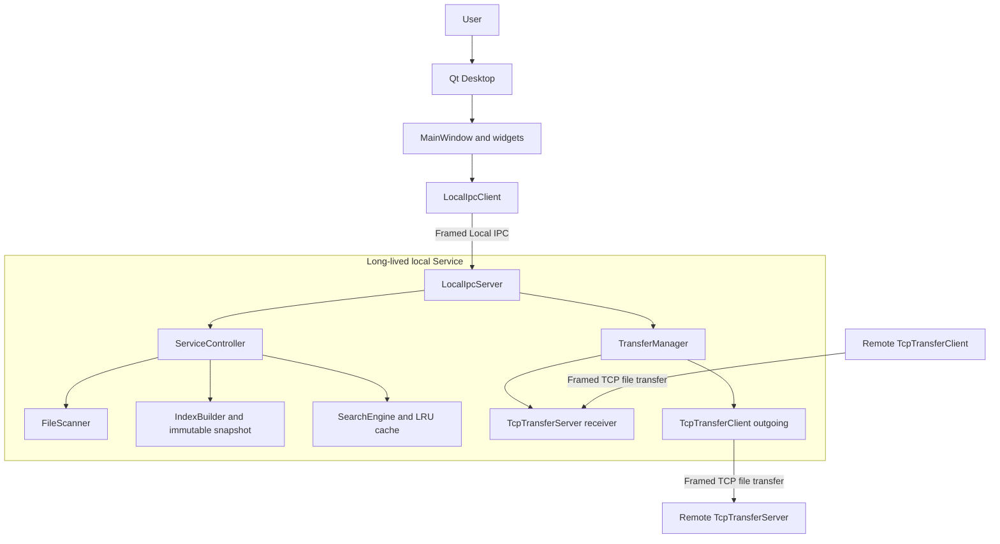
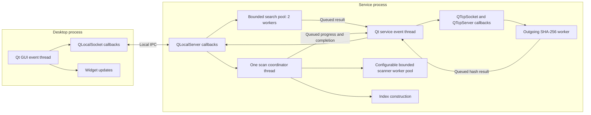
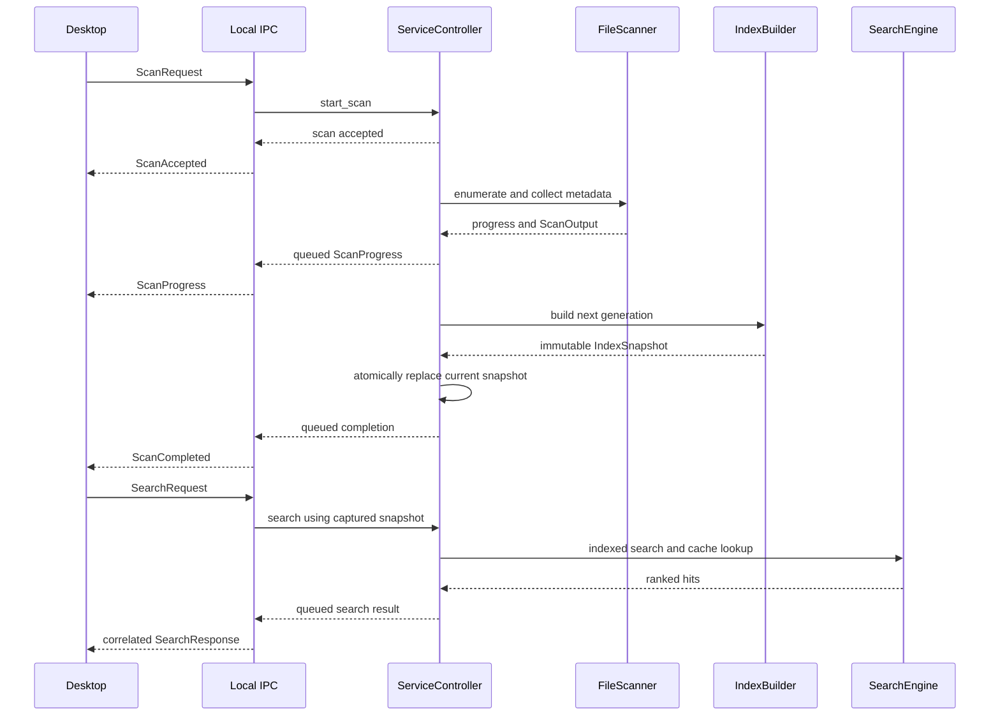
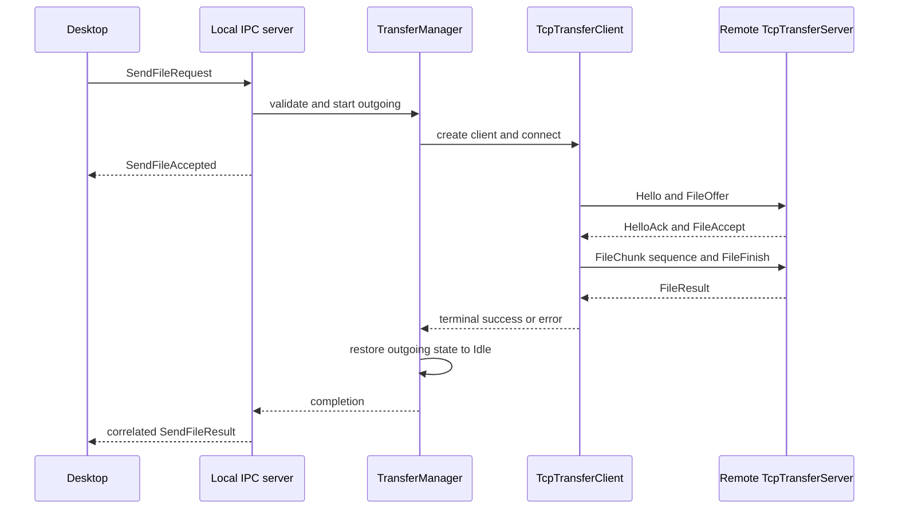

# CoreDesk Architecture

CoreDesk separates a thin Qt Desktop from a long-lived local Service. The
Desktop collects user input and presents results; the Service owns scanning,
the current search index, and LAN-transfer state. This document summarizes the
resulting ownership, threading, and data-flow boundaries.

## Design goals

- Keep the Desktop responsive by moving filesystem and index work into the
  Service process.
- Keep reusable Core modules in standard C++20 and confine Qt to applications,
  UI code, and adapters.
- Bound concurrency and sender-side transfer buffering instead of allowing
  work queues or whole files to grow in memory without limit.
- Keep Local IPC commands distinct from the TCP protocol used between peers.
- Support a deliberately small trusted-LAN feature set with explicit limits.

## System overview

The Desktop never owns the TCP backend and does not call scanner or search
implementations directly. All Desktop operations cross the Local IPC boundary.
The Service remains independently running when the Desktop closes.

## Component responsibilities

| Component | Responsibility |
|---|---|
| `MainWindow` and widgets | User input, connection state, request correlation, and presentation |
| `LocalIpcClient` | Desktop-side framed Local IPC transport |
| `LocalIpcServer` | Service-side IPC connections, schema dispatch, and response routing |
| `ServiceController` | Scan lifecycle, cancellation, snapshot installation, and search access |
| `FileScanner` | Directory enumeration and concurrent metadata collection |
| `IndexBuilder` | Builds a new immutable, generation-tagged index snapshot |
| `SearchEngine` | Exact/prefix indexed lookup, substring fallback, ranking, and LRU caching |
| `TransferManager` | Receiver configuration and ownership of one active outgoing transfer |
| `TcpTransferServer` | Incoming TCP protocol, `.part` file writes, validation, and finalization |
| `TcpTransferClient` | Outgoing hash, offer, bounded chunk pumping, and terminal result handling |

## Core and Qt boundary

The common, concurrency, filesystem, index, protocol, and service-controller
modules are pure C++20. Qt types are limited to the application, UI,
`adapters/qt_ipc`, and `adapters/qt_network` layers. `ServiceController`
therefore has no dependency on Qt Network, while the Service application
composes it with the Qt adapters.

With `COREDESK_BUILD_UI=OFF` and `COREDESK_BUILD_NETWORK=OFF`, Core, CLI,
benchmarks, and Core tests build without Qt. The exact feature matrix and
tested platform boundary are recorded in [BUILD.md](BUILD.md).

## Thread model

The Desktop UI and its socket callbacks stay on the Desktop Qt event thread.
The Service Qt event thread owns Local IPC and TCP socket activity. Search work
uses the `LocalIpcServer`'s bounded two-worker pool. A scan request starts one
joinable coordinator `std::thread`; `FileScanner` enumerates there and uses a
temporary `ThreadPool` for metadata tasks. Its worker count is request-driven,
with a hardware-based default, and the queue is bounded to 4096 tasks.

The scan coordinator also builds the replacement index. Progress and terminal
callbacks are posted back to the Service Qt object before touching IPC sockets.
The outgoing client computes the source SHA-256 on a joinable worker and posts
the result back to its Qt object. Incoming chunk file writes and incremental
hash updates currently execute on the Service Qt event thread; workerization
is deferred unless isolated evidence justifies it.

An exception that escapes a `std::thread` entry point can terminate a process.
`ServiceController` catches scan-thread failures, converts them to structured
errors, and restores its state. The pre-merge defect and regression test are
described in [BUG_POSTMORTEM.md](BUG_POSTMORTEM.md).

## Scan and search flow

`ServiceController` publishes the new `shared_ptr<const IndexSnapshot>` only
after scanning and index construction succeed. Search copies the current
snapshot under a shared lock and can continue using the previous generation
while a replacement scan is in progress. Installing a new generation clears
the search cache.

## LAN transfer flow

For receiving, the Desktop enables or configures the receiver through Local
IPC; `TransferManager` owns the long-lived `TcpTransferServer`. For sending,
the same manager creates and owns one `TcpTransferClient`. A second outgoing
request returns `Busy`. Incoming and outgoing state are separate: an outgoing
failure does not stop the receiver, and loss of the requesting Desktop IPC
connection does not cancel a Service-owned transfer.

The sender reads 256 KiB chunks, stops adding data when Qt's pending-write
queue reaches the 2 MiB high-water mark, and retains at most one encoded-frame
application remainder after a partial write. It does not buffer the whole
file. The receiver writes a `.part` file and only finalizes it after protocol
and SHA-256 checks succeed. Measurements and the precise memory boundary are
in [PERFORMANCE.md](PERFORMANCE.md).

## Ownership and lifetime

- `MainWindow` contains its `LocalIpcClient`; Qt parent ownership covers the
  widgets and timers it creates.
- The Service `main` function owns the logger, `ServiceController`, optional
  `TransferManager`, and `LocalIpcServer` for the event-loop lifetime.
- `LocalIpcServer` owns its `QLocalServer` and per-connection state. Async
  callbacks use guarded Qt pointers before returning results to a requester.
- `ServiceController` owns and joins its scan thread and holds the current
  immutable snapshot through `shared_ptr<const IndexSnapshot>`.
- `TransferManager` contains the receiver and owns the active outgoing client
  with `unique_ptr`. Terminal completion is idempotent and returns the manager
  to Idle before invoking the completion callback.

## Protocol boundary

Local IPC and peer-to-peer TCP both use the common frame codec, but they carry
different operations. Desktop/Service management commands occupy the Local IPC
message range, including outgoing request, acceptance, and result messages.
Peer transfer messages use the separate `100+` range for handshake, offer,
chunks, finish, and result. See [PROTOCOL.md](PROTOCOL.md) for the authoritative
wire values and payload schemas.

## Architectural boundaries

- Desktop does not link `coredesk_service_lib` or `coredesk_qt_network`.
- Pure Core public interfaces contain no Qt types.
- Service-owned work survives a Desktop disconnect where the operation itself
  remains valid.
- Request IDs prevent unrelated or stale IPC responses from changing current
  Desktop state.
- TCP connection-local state prevents one peer from cleaning up another peer's
  active receive.
- Benchmark executables exercise production modules; production applications
  do not depend on benchmark targets.

## Trade-offs and deferred work

The separate Service adds IPC and lifecycle complexity, but keeps indexing and
transfer ownership out of the GUI process. Framed IPC adds serialization cost,
but supplies message boundaries, schema validation, and request correlation.
Bounded chunked transfer limits sender memory at the cost of a more explicit
write-pump state machine. Allowing only one outgoing transfer at a time keeps
ownership and recovery deterministic for v1.0.

CoreDesk v1.0 is a trusted-LAN utility, not an authenticated secure
file-sharing product. TLS, authentication, peer discovery, resume, transfer
history, outgoing progress, cancellation, and timeout UI remain deferred, as
do logger rotation and Linux Qt application/network verification. Windows full
application behavior, Linux Core + tests, and Linux Core ASan have been
verified; Linux Qt Desktop, Local IPC/service, and TCP paths are **not
verified**. See [BUILD.md](BUILD.md) for the exact platform evidence boundary.
